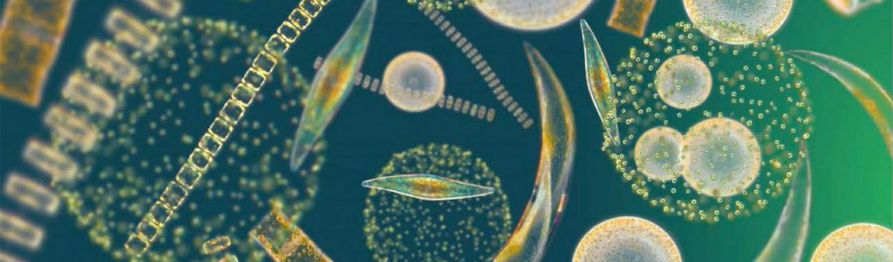

# Machine Learning for Phytoplankton Understanding


## Overview
Marine biology is at the heart of global climate regulation, carbon dioxide ($CO_2$) control, and biodiversity. This project, conducted at **EILCO**, aims to group and classify types of phytoplankton and their associated pigments to identify biological interactions using **Unsupervised Machine Learning**. 



By analyzing pigment concentrations from global databases, we identify distinct biological groups that serve as indicators of oceanic biomass and ecosystem health.

## Methodology
The project follows a rigorous data science pipeline combining biological expertise with machine learning algorithms.

### 1. Data Preprocessing
Starting with a global database of 9,484 samples:
* **Cleaning**: Removed missing values and non-essential features (latitude, longitude, date).
* **Outlier Filtering**: Excluded values above the 95th percentile and below the 5th percentile to ensure model robustness.
* **Log Transformation**: Applied $log_{10}$ transformation to handle the wide range of concentrations and improve feature distribution.

### 2. Dimensionality Reduction (PCA)
Principal Component Analysis (PCA) was used to reduce redundancy:
* **Dimensions**: The first three dimensions were retained, covering the majority of the variance (Dim1: 57%, Dim2: 17%, Dim3: 10%).
* **Significance**: This step allowed us to focus on the most influential pigment correlations.

### 3. Clustering (K-Means)
To categorize the phytoplankton:
* **Algorithm**: K-Means++ for optimized centroid initialization.
* **Optimization**: The "Elbow Method" was used to determine the optimal number of clusters (**K=4**).

## Key Results & Interpretation
The analysis successfully identified four distinct ecological clusters:
* **Cluster 0 (Diatoms)**: High concentrations of Chlorophyll-a and Fucoxanthin.
* **Cluster 3 (Cyanobacteria)**: High Divinyl Chlorophyll-a and Zeaxanthin (Prochlorococcus).
* **Clusters 1 & 2**: Represent small and medium-sized phytoplankton groups.

## Repository Structure
```text
├───README.md
│   
├───data
│       Data_Etude_de_Cas.csv
│       
├───docs
│       project_report.pdf
│       
└───notebooks
        Phytoplancton.ipynb
```

## Authors
* **Students**: Alice LITOU, Théo SMOCH, Rayane SAADI, Robin BECARD, Alexandre GOETINCK.
* **Supervisor**: Roy EL HOURANY.
* **Institution**: EILCO (École d'Ingénieurs du Littoral Côte d'Opale).
